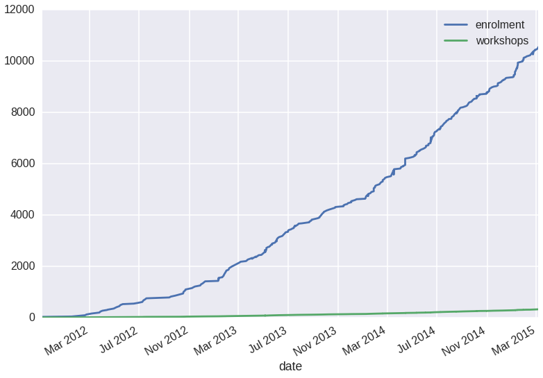
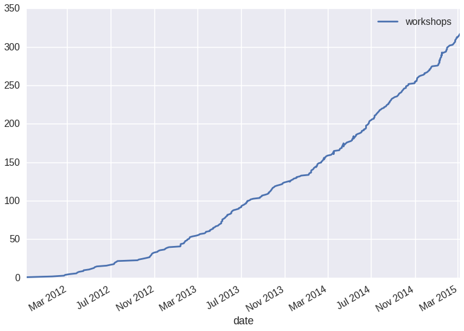

# Enhance Amy, a workshop-management platform for Software Carpentry

## Abstract

The number of Software Carpentry's workshops run weekly is growing rapidly
(see Fig. 1 below).  All the management for these workshops is currently being
done by 1-2 persons and in very rough conditions (via files and text notes).
That's why Amy was created in December 2014: to help Software Carpentry admins
schedule workshops, assign instructors to workshops, and even coordinate
training for new instructors.

Fig. 1: Cumulative workshops' enrolment.

Fig. 2: Cumulative number of workshops.

The aim of this project is to continue enhancing Amy.  Many people
[suggested great ideas](https://github.com/swcarpentry/amy/issues?q=is%3Aissue+is%3Aopen+label%3Aenhancement+-label%3Aessential) for Amy,
some even [implemented them](https://github.com/swcarpentry/amy/pulls?q=is%3Apr+is%3Aopen+sort%3Acreated-asc), but not much was actually
merged.  As a result, in March
[we can see a drop in new commits](https://github.com/swcarpentry/amy/graphs/contributors).

## Features

Integration that will allow Amy admins to easy control workshop-related
services:

* integration with Eventbrite
    * check if an event's registration exists
    * check if an event's registration is running
    * maybe bulk-load event attendees
* integration with Mailman
    * list people signed up for a specific list
    * list lists person is signed up to
    * create per-workshop lists for instructors, helpers, and hosts
* integration with GitHub
    * OAuth login

New functionality this project should bring into Amy:

* reports (statistics)
    1. number of people taught
    2. number of instructors
    3. number of workshops run to date
    4. workshop enrolment per workshop
    5. workshops without enrolment numbers
    6. how many times an instructor has taught
    7. list of instructors who have never taught
    8. number of instructor trainees per cohort
    9. instructors who have been badged in the last N months
* charts - some of the reports above could use nice visualization, for example:
    * line chart: number of people taught
    * line chart: number of instructors
    * line chart: number of workshops

On [Amy issues page](https://github.com/swcarpentry/amy/issues) there are
several long-standing issues. I selected a few that I think are important:

* Test fixtures [#184](https://github.com/swcarpentry/amy/issues/184) and
  [#158](https://github.com/swcarpentry/amy/issues/158)
* DataTables pagination [#129](https://github.com/swcarpentry/amy/issues/129)
  - this one has a [PR included](https://github.com/swcarpentry/amy/pull/134)
  but it has not been merged
* Continuous Integration and coverage reporting [#166](https://github.com/swcarpentry/amy/issues/166)
* Developer guidelines [#108](https://github.com/swcarpentry/amy/issues/108) -
  personally I think we need to establish some explicit rules (e.g. who's
  responsible for merging, what code style we should follow, etc.)
* Event enhancements ([Allow hosts, instructors, and helpers to be selected on event details page #16](https://github.com/swcarpentry/amy/issues/16),
  [Use calendar pop-up for picking dates for workshops #18](https://github.com/swcarpentry/amy/issues/18),
  [Event details page should include links to assessment forms #20](https://github.com/swcarpentry/amy/issues/20),
  [Event_sponsor table #74](https://github.com/swcarpentry/amy/issues/74),
  [Additional event attendance information (slots and applicants)? #64](https://github.com/swcarpentry/amy/issues/64),
  [Automatic email reminders about upcoming workshops to admins #51](https://github.com/swcarpentry/amy/issues/51))

Additionally, if enough time is given, I can work on other issues.

## Technical Details

For Eventbrite integration I'll use
[Eventbrite REST API](https://developer.eventbrite.com/docs/).  It should be
straighforward — we only want to know if an event is available.

Integration with Mailman will be possible if:

1. Mailman 3 [arrives](http://wiki.list.org/DEV/Mailman%203.0) (maintainers
   hope to release it in April 2015) as it brings long-awaited REST API
2. Software Carpentry migrates to Mailman 3.0

Alternatively, if Mailman v3 doesn't appear in time for GSoC 2015, the
integration would mean running shell commands directly from Amy.

In case integration with Mailman is quite extensive, I'll consider using
[valor](https://github.com/jacobian/valor/) as an easy OOP integration layer.

Additionally, if there's an issue with timeouts to Eventbrite or Mailman
endpoints, I'll consider using [Celery](http://www.celeryproject.org/) as
a simple queueing system.

I have never done social authentication in Django, but people at
StackOverflow suggest to use
[python-social-auth](http://python-social-auth.readthedocs.org/en/latest/).
An alternative -
[django-allauth](http://django-allauth.readthedocs.org/en/latest/) -
seems to provide "local" authentication (ie. what we have now - via
email/password) as well.

Statistics (or *reports*) are not fancy - they are database queries; hopefully
I'll be able to implement all of them in Django ORM.  In case of Report#4,5 or
Report#6,7 or Report#9 I'll provide an UI to easily view specific
people/workshops.

I want to implement DataTables before diving into reports.  DataTables should
help a lot when viewing existing listings in Amy, too.

To implement charts I'll use Mozilla's
[MetricsGraphics.js](http://metricsgraphicsjs.org/) as it's the most stable
and well developed charting library for JavaScript I've seen in a while.

## Schedule of Deliverables

A word on my availability:

In the month of June I have to prepare for exams. I'll make sure to be
spending at least 20hrs per week on this project.

My exams are not scheduled yet, but the timeslot for them is
**June 23rd - July 7th**. In this time I won't be able to work on the project.
However, most likely I'll be over with the exams by the end of June - in that
case I'll resume working on the project as soon as I pass everything.

If the [Developer guidelines](https://github.com/swcarpentry/amy/issues/108)
aren't ready in time for GSoC 2015, I want to start with them so that I know
what I can and cannot do.

Additionally I want to point out that anyone can start working on issues this
project will focus on during GSoC 2015.  Hence changes to the schedule below
may be expected.

### May 25th - June 7th

A sort of "cleaning up" time period:

* Write down Developer guidelines.
* Push to close any remaining pull requests.
* Create issues on [Amy's GitHub page](https://github.com/swcarpentry/amy/) for
  the topics in this project that were not yet in there.
* Triage GitHub issues (ie. create milestones and assign issues to them.)
* Probably (as a result of finished Developer guidelines) launch Travis-CI and
  Coveralls for Amy (see
  [#166](https://github.com/swcarpentry/amy/issues/166)).

### June 8th - June 21st

* Implement DataTables.
* Implement EventBrite integration.
* Implement GitHub login integration.
* Provide tests for these features.

### June 22nd - July 5th

I'm unavailable due to exams.

### July 6th - July 19th

* If Mailman3 is out: work with Software Carpentry admins to upgrade existing
  Mailman 2.x [installation](http://lists.software-carpentry.org/)
* Integrate with Mailman.
* Test Mailman integration.

### July 20th - August 2nd

* Create reports and reports' pages.
* Provide tests for these features.
* Create colorful charts.

### August 3rd - August 16th

* Work on remaining issues for Amy like test fixtures or event enhancements.

### August 17th - August 21st 19:00 UTC

* Work on remaining issues for Amy like test fixtures or event enhancements.

## Future works

I've been involved with Software Carpentry for almost a year now. I'm
a Software Carpentry instructor, Software Carpentry Foundation member and
I don't plan to leave.

## Open Source Development Experience

2010-2012: cooperation with
[Oregon State University Open Source Lab](http://osuosl.org/):
[Ganeti Web Manager](http://ganeti-webmgr.readthedocs.org/en/latest/) project
(during two GSoCs and one Google Code-In).

GSoC 2014: [Peer instruction](https://github.com/pbanaszkiewicz/pitt) project
for Mozilla Science Lab (and Software Carpentry).

Since January 2015: [Amy](https://github.com/swcarpentry/amy) for Software
Carpentry.

## Academic Experience

I'm studying Automatics Control and Robotics at
[AGH-UST](http://www.agh.edu.pl/en) in Krakow, Poland. I know understand quite
a bit of Mathematics, including optimization theory, control theory,
probability, and others. Additionally I've got to know many industrial
automatics systems (PLCs, robots, etc.), I'm also good at Matlab. I posses a
LabView certificate (CLAD).

## Why this project?

Four reasons why I started working on Amy:

1. I wanted to give back to Software Carpentry
2. I knew Amy was (and still is) really needed for Software Carpentry to
   continue developing at current pace.
3. I was familiar with technologies Amy was written in.
4. I promised Arliss on MozFest 2014 in London that I'll work on Amy :-)
